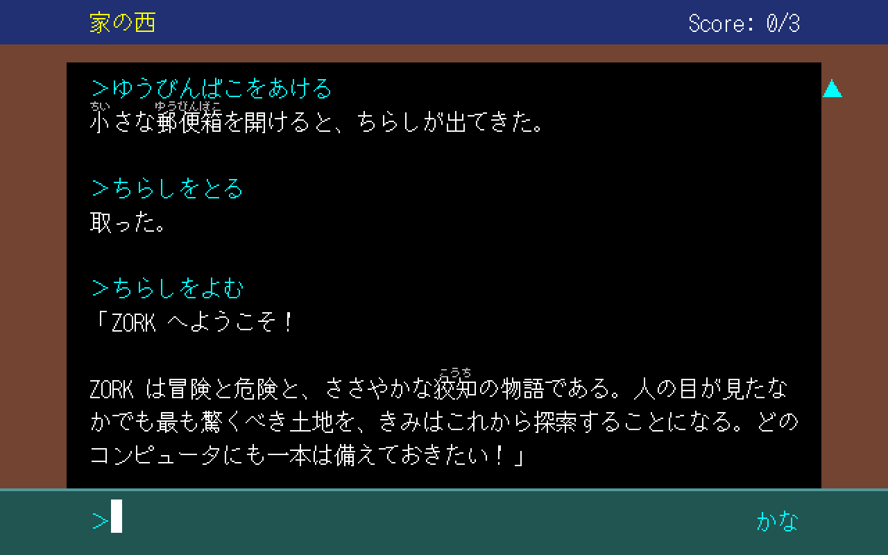
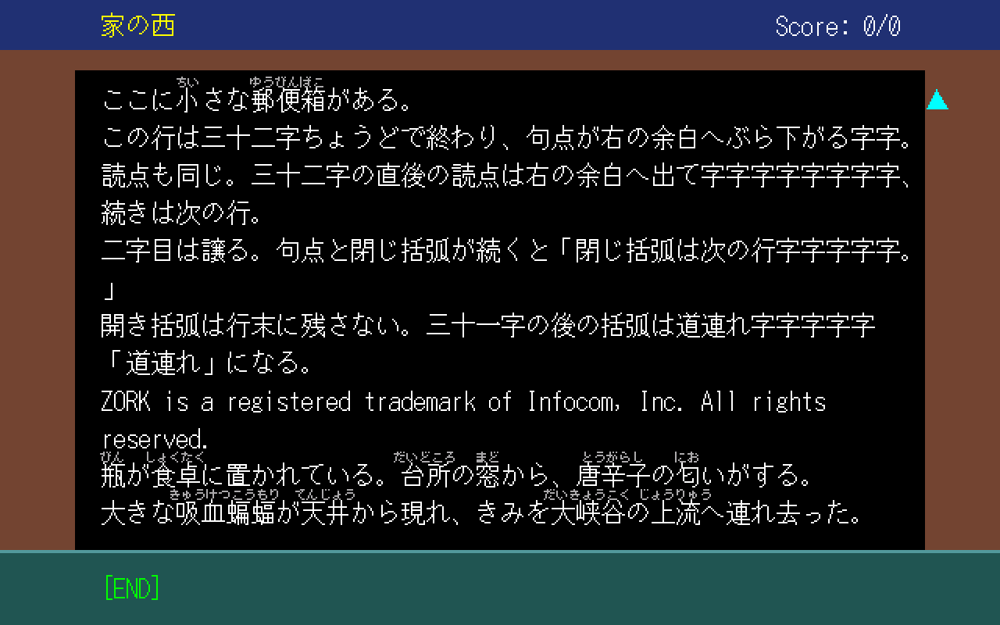

# Zenmai PC-98 版 移植計画

**状態: ver. 0.3.0-beta を公開した**（2026-09-30・[Release `pc98-v0.3.0-beta`](https://github.com/msonrm/zenmai/releases/tag/pc98-v0.3.0-beta)・pre-release）。
0.2.0-beta（2026-09-29）からの差 = 段 8（作品をファイルに・Zork II / III を英語で同梱・起動画面で作品を選ぶ・QuuBee の拡張 1MB でも動く）。
以下は 0.2.0-beta のときの記述:
0.1.0-beta（2026-09-28）からの差 = 段 6（ファンクションキーの行・ふりがなの 1px・ボタンの言い方）と段 7（起動画面の曲）、起動画面を日本語が上に。
★**次は実機で試した人の報告を待つ**こと（msonrm は実機を持っていない）。やることの一覧は末尾の「次にやること」。
画面は **QuuBee の上で実際に表示して**決めた（道具と撮った画面 = [`pc98-mock/`](../pc98-mock/README.md)）。

## 進め方

★**危ないところを先に潰し、形は動かしてから決める**（画面を QuuBee で表示してから決めたのと同じ順）。

| 段 | 中身 | 確かめ方 | |
|---|---|---|---|
| 0 | 道具: Open Watcom + DOS/4GW の EXE が QuuBee で動く | | ★済 |
| 1 | 素の Zork: MojoZork・訳・語彙を載せ、訳文を標準の 80×25 に流す | 台本をホストと QuuBee で流し、記録が 1 バイトも違わない | ★済 |
| 2 | 境界を引く: `main.c` の VM とのつなぎを `session.c` へ抜き出し、PC-98 の本文を `render_pc98.c` に | PS1/SDL の既存の検査 8 本が崩れない・PC-98 の記録が段 1 と同じ | ★済 |
| 3 | 入力: ローマ字 / カナキー → かな、CAPS で英字 | 打鍵の核をホストで検査・打鍵で打った台本の記録がかなの台本と同じ | ★済 |
| 4 | 画面の仕上げ: 24 ラスタ × 16 行・ふりがな（`jp_text.c` を載せる）・禁則（表を共有へ出す）・上の帯・履歴の遡り | 組み方をホストで検査・`#!line` の台本で画面を見る・PS1/SDL の 8 本 | ★済 |
| 5 | 配る形: 起動画面（Zenmai → Zork I → ENGLISH / 日本語）・英語モード・版・書庫と説明書・Release | 英語面の台本・書庫の中の .BAT だけで起動・拡張メモリ 2MB で起動 | ★済 |
| 6 | 実機の報告を受けて直す | 実機（報告してくれる人） | 次 |
| 7 | 以降: 音楽・イラスト | 録った音を周波数で測る（QuuBee の `captureAudio`） | 起動画面の曲は済 |
| 8 | 作品をファイルに（パック）・起動画面で作品を選ぶ・Zork II / III | 記録が変更前と 1 バイトも違わない・拡張 2MB で検査・PS1/SDL の 8 本 | ★済（0.3.0-beta） |

### 段 1 でできたもの（2026-09-28）

| ファイル（`native/`） | 役目 |
|---|---|
| `main_pc98.c` | 入口（段 2 で `session.c` に載せ替え、写しは消えた） |
| `pc98_text.{c,h}` | テキスト VRAM に字を置く層。`PC98_HOST` でホストの配列に向けても建つ |
| `pc98_jis.py` → `pc98_jis.{c,h}` | UTF-16 → テキスト VRAM の語（7,333 字）。★**字のコードの正典**（`pc98-mock/layout.py` もこれを読む）。訳・語彙の字が 1 つでも引けなければ生成が止まる |
| `build-pc98.sh` | → `pc98-out/ZENMAI.EXE`（544KB・DOS/4GW）と、同じ芯をホストで建てた `pc98-out/zenmai-host` |
| `pc98_run.js` / `test-pc98.sh` | 台本を QuuBee（headless）とホストで流して記録（`ZENMAI.LOG`）を突き合わせる |
| `pc98-test/kana.txt` | かなで打つ台本（聞き返し・知らない言葉・別案・セーブの往復） |

- ★**walkthrough 211 手（1,127 行）とかなの台本（103 行）がホストと 1 バイトも違わない**。211 手はエミュの 5.3 秒で流れる
- ★**`SET DOS16M=1` が要る**（PC-98 の A20 の開け方を DOS/4GW に教える。無いと `DOS/16M error: [26] 8042 timeout`）。
  実機でも同じ設定なので、配布では起動用の .BAT に書く
- `wcc386 -za99` で共有の C はそのまま通った。落ちたのは `render.c`（自動変数の集成体を非定数で初期化）だけ ——
  PC-98 では使わない
- セーブは `ZENMAI.SAV`（書式は PS1/SDL と同じ）
- 段 1 の画面は仮: 0 行目に状態、2〜22 行目に本文（76 桁・禁則なし・ASCII の語だけ割らない）、24 行目に入力欄。
  入力は ASCII だけ（英語のコマンドも `cmd_run` が通す）、ESC でやめる

### 段 2 でできたもの（2026-09-28）

| ファイル（`native/`） | 役目 |
|---|---|
| `session.{c,h}` | ★**芯**: MojoZork を抱え、打った言葉を VM に渡し、出力を訳して本文へ流すまで。**PS1 / SDL / PC-98 が共有する**。`main.c` から中身を変えずに移した |
| `render_pc98.{c,h}` | PC-98 の本文。★`render.h` の**文字列の口**（`draw_plain` / `draw_echo` / `hist_line` / `hist_blank`）を同じ名前で実装する。記録（`ZENMAI.LOG`）もここで書く |
| `save_dos.c` | `card.h` の DOS 版（`ZENMAI.SAV`） |

- ★**切り方**: `session.c` は「打った → 本文に積んだ」までで止まる。画面側の前後（遡り中なら下端へ跳ぶ・状態行・
  新しい内容を見せる送り・入力欄を空にする）は各版の入口に残した —— 描く順番が抜き出す前と同じになる
- ★**確かめたこと**: PS1/SDL の既存の検査 8 本（`test-sdl` の画素一致ほか）が抜き出す前後とも緑。
  PC-98 の記録は段 1 の記録と 1 バイトも違わない（ホスト）し、QuuBee とも一致する
- ★**禁則の共有は段 4 に回した**。段 2 の本文は禁則を使わないので、使う段で表を出す
  （出すときは `check_kinsoku.py` が `render.c` の表を読んでいるのも直す）

### 段 3 でできたもの（2026-09-28）

| ファイル（`native/`） | 役目 |
|---|---|
| `kana_input.{c,h}` | 打鍵 1 つずつを受けて入力欄の字を組み立てる核（画面を知らない）。キーボードも台本の `#!keys` もここを通る |
| `vendor/mozc/` → `gen_kana_input.py` → `kana_input_data.{c,h}` | ローマ字の表（★**Mozc の `romanji-hiragana.tsv` をそのまま**・BSD 3-Clause）・半角カナ → ひらがな・濁点の合成 |
| `test_kana_input.c` | 核のホスト検査（`test-pc98.sh` が最初に流す） |
| `pc98-test/romaji.txt` | `kana.txt` と同じコマンドを打鍵（ローマ字・カナキー）で打つ台本。★記録が `kana.txt` と 1 バイトも違わないことを見る |

- ★**打ち方は 3 通り**: ローマ字（普段）・カナキー（PC-98 のカナキーはロック式。ロック中の半角カナをひらがなにし、ﾞ ﾟ は前の字にかぶせる）・
  **CAPS で英字**（表を通さない）。★`cmd_run` は**全部 ASCII なら英語のコマンド**として VM に渡すので、英語でも遊べる。
  大文字は CAPS でなくても素通し。★入力欄の右端の「かな / 英字」の表示は**やめた**（打てば分かる・msonrm の判断・2026-09-29）。
  CAPS はキーが来たときに BIOS で読む
- ★**ローマ字の規則を自前で書かなかった理由**: 打つ人の指が覚えている規則（`nn` → ん・`kk` → っ など）に合わせるため。
  表どおりなので `konnichiha` は「こんいちは」になる（`konnnichiha` で「こんにちは」）
- ★**ゔ（U+3094）は漢字 ROM に無い**（JIS X 0208 の外）ので ヴ に寄せた
- ★**ESC は読み捨てる**。PC-98 ではファンクションキーなどの列の頭にも ESC が来るので、「やめる」に使うと誤って抜ける。
  やめるのはゲームの「やめる」（quit）
- QuuBee の上で実際のキー（ローマ字・BS・CAPS のロック・カナのロック）を押して、入力欄と応答を目で確かめた
- ★**配るときの義務**: ローマ字の表は Mozc 由来なので、配布物の文書に Mozc の著作権表示と BSD 3-Clause の全文を入れる
  （`native/vendor/mozc/README.md`）

### 段 4 でできたもの（2026-09-28）

| ファイル（`native/`） | 役目 |
|---|---|
| `kinsoku.h` | ★**禁則の表と「語を作る字」を `render.c` から出した**（`static inline`）。PS1 / SDL の `render.c` と PC-98 の `render_pc98.c` が同じ表を見る。`check_kinsoku.py` もここを読む |
| `render_pc98.{c,h}` | 本文の組み方と窓（書き直し）。`jp_text.c` が載り、ふりがなは PS1 と同じ規則で割り当てる |
| `pc98_gfx.{c,h}` | グラフィック画面（640×400・16 色）: 装飾の地とふりがなの字形 |
| `pc98_text.{c,h}` | 1 行 24 ラスタにする（試作 `screen.asm` の CRTC / GDC の設定を C へ） |
| `gen_misaki.py` → `misaki_data.{c,h}` | ふりがなの字形（美咲ゴシック 170 字）。★BDF は追跡しないので、あるときだけ焼き直す（`vendor/misaki/`） |
| `test_render_pc98.c` | 組み方のホスト検査（ぶら下げ・`。」`・開き括弧の道連れ・英字の語・ふりがなの位置と重なり） |
| `pc98-test/layout.txt` | 組み方を画面で見る台本（`#!line 文` = 文をそのまま本文に流す）。画面は `pc98-out/layout-1x.png` |

- ★**ふりがなは親字を動かさない**（テキストは 8px の格子）。読みは親字の中央に置き、前の読みとぶつかるなら右へずらす。
  右の装飾に掛かるなら、ぶつからない範囲で左へ戻す（2026-09-28 に決めた = 下の「ふりがな」の (a)）
- ★**ぶら下げは PS1 と同じ規則**: 行頭禁則の 1 字だけを、窓の右の全角 1 字ぶん（72〜73 桁目・横 576〜591）へ出す。
  テキスト画面には「窓」という区切りが無いので、その行だけ 1 字右に置ける（画面で確かめた）。2 字目（`。」` の `」`）は次の行
- ★**行の高さは一律**（どの行にも 8 ラスタのふりがなの帯）。PS1 の「英字だけの行は帯を取らない」は無い
- ★**本文は組んだ行の環（400 行）**で持ち、窓の 12 行はそこから描き直す。ROLL DOWN / ↑ で遡り、ROLL UP / ↓ で戻る。
  窓の外に続きがあれば右の装飾に ▲ ▼。遡ったまま打って送ると、下端へ跳んでから出す（PS1 と同じ）
- 新しい出力は、キーボードで遊ぶときは 1 行ずつ送って見せる（台本のときは待たない）
- ★**キーは BIOS（INT 18h）から直に読む**。DOS を通すとファンクションキーが ESC で始まる列になり、字と混ざる
- ★**BIOS のカーソルは使わない**（24 ラスタの行を知らない）。入力欄のカーソルは反転の空白を置く
- DOS へ返るときは DOS の行数（20 / 25）に戻し、グラフィックを消して 8 色（デジタル）に戻す（画面で確かめた）。
  ★テキスト画面は起動したときのものを戻す（段 6 で直した = 下の「段 6」）
- ★**Watcom は自動変数の構造体を非定数で初期化できない**（`render.c` が落ちたのと同じ）。項目ごとに代入する
- ★**公開版の QuuBee（ブラウザ）で遊べた**（2026-09-28・msonrm）。「普通に快適にプレイできる」。
  そのとき左右の装飾を 48 → 40px に狭めた（下の「画面の構造」）

### 段 5 でできたもの —— 起動画面・英語モード・配る形（2026-09-28）

- ★**Zenmai は Z-machine で、Zork I はその上で動く見本の作品**という形を取る（msonrm の判断）。
  商標の「ZORK」を前に出さない —— 書庫の名前（`zenmai98-<版>.zip`）にも入れない。説明書に商標の一文を置く
- 起動するとまず **`Zenmai` の起動画面**。PS1 版の起動メニューと同じ形（題 → 説明 → 罫線 → 作品名 `Zork I` →
  日本語 / ENGLISH）。★並びも既定の選択も **日本語が上・既定**（PC-98 なら日本語が主。msonrm の判断・2026-09-29。それまでは PS1 版と同じく ENGLISH が上・既定だった）。
  2 つの項目は**左端をそろえる**（選ぶ印 ＞ が左にあるので）。案内は「↑↓ で選び、Return キーでゲームスタート」（PC-98 のキーは RETURN）
- ★**英語モード**（未決 7）はこの選択で入れた。芯（`session.c`）は最初から英語を扱えるので、入口だけ:
  訳さずに流し、状態も英語のまま、キーは表を通さない。台本は 1 行目の `#!english` で英語面
- ★**版は `native/pc98_version.h` の 1 か所**（いま `0.2.0-beta`）。起動画面と、書庫の名前・説明書（`pack-pc98.sh` が読む）が同じ番号を出す。
  付け方は PS1 版（`ps1-vX.Y.Z`）に揃える
- ★**メモリ**: 本体だけで約 920KB（リンカの地図の Memory size = 941,024 バイト。表 488KB・作業域 380KB・機械語 68KB）。
  ★段 8 で story と大きな作業域を外へ出し、像は約 618KB + 起動後に約 255KB になった（下の「段 8」）。
  QuuBee で拡張メモリ 1MB だと DOS/4GW が `fatal error (1307): not enough memory`、2MB で起動した。
  本文の履歴を 400 → 100 行に減らしても 1MB では足りない（大きいのは訳・語彙・story の表）ので、要件は **拡張 2MB 以上**
- 説明書（`README.TXT`・Shift_JIS）には **beta 版であること・実機では未確認であること**と、
  ★**実機で試してくださる方へ**の確かめてほしい点（とくにふりがなの帯 = PL = −8 が実機で同じに出るか）と報告先（GitHub の issues）を書いた
- ★**書庫を作る台本 = `native/pack-pc98.sh`**（→ `pc98-out/zenmai98-<版>.zip`）。中身は `ZENMAI.BAT`（`SET DOS16M=1`）・
  `ZENMAI.EXE`・`DOS4GW.EXE`・`README.TXT`・ライセンスの全文 3 本（Zork I / MojoZork / Mozc）。文書は Shift_JIS・CRLF
- ★**Release**: タグ `pc98-vX.Y.Z-beta`（0.1.0-beta・0.2.0-beta）は `feat/pc98` の上・pre-release（PS1 版の Latest はそのまま）。★`feat/pc98` は 2026-09-29 に main へ入れた（PR #50）
  ★公開の直後に説明書の「カナ錠」を「カナキーをロックする」に直し、**添付の ZIP を同じ名前で差し替えた**。
  タグはそのまま（公開したタグは動かさない）なので、タグの時点の `pack-pc98.sh` で作り直すとこの 1 行だけ古い

### 段 6 —— 実機の報告で直したもの（2026-09-28〜）

★**実機で動いた**（2026-09-28・X で告知した後に報告が来た）。ファンクションキーの行のほかに不具合は無かったとのこと
（ふりがなの帯については触れていなかった）。

- ★**終了して DOS に戻ると、画面下のファンクションキーの行が消えたまま**（実機の報告）。
  原因 = 起動時と終了時にテキスト VRAM を 25 行ぶん消していた。あの行は DOS（CON）が一度描いたきりで、
  DOS は消されたことを知らないので描き直さない。★**QuuBee の DOS は模擬（HLE）でこの行そのものを持たない**ので、
  QuuBee では気付けなかった。
  → ★**起動したときのテキスト VRAM（字と属性・25 行ぶん）を控えて、終了時にそのまま戻す**（`txt_init` / `txt_fini`）。
  ESC 列（`ESC[>1h` / `ESC[>1l`）で DOS に描き直させる形はとらなかった —— 「出したまま」の状態で `>1l` を送って
  描き直すかは DOS の版しだいで、確かめる手段が実機しかないため。
  あわせて、行数は DOS の作業領域 `0060:0113h`（1 = 25 行 / 0 = 20 行）に合わせ（前は 25 行に決め打ち）、
  カーソルは DOS が覚えている位置（`0060:0110h` = 行・`0060:011Ch` = 桁）へ戻す（前は左上 = DOS の出力位置とずれていた）。
  QuuBee で終了後の画面を撮って、起動前の表示が戻り、DOS の次の出力がその直下に続くのを確かめた

### 段 7 —— 起動画面の曲（2026-09-29）

> ★★**2026-09-30: 鳴らし方を PMD に替えた**（msonrm の判断「起動画面の曲も自前をやめ、PMD にしましょう」）。
> 下の「音色」「音量」「鳴らし方」「1 オクターブ上に出た罠」は **自前の FM 直叩き（`pc98_fm.c`・削除）の時代の記録**で、
> 音の正典（`gen_canon.py` の書き起こし）と「出どころ」「確かめ方」は今も生きている。今の形は下の
> 「**段 7b —— PMD で鳴らす**」。

★**起動画面で J. S. Bach『音楽の捧げもの』BWV 1079 の 2 声のカノン「Quaerendo invenietis」（謎カノン）を鳴らす**（msonrm の提案）。
著作権の心配が無いクラシックで FM 音源を試すため。

- ★**音の正典は `native/gen_canon.py`**（→ `canon_data.{c,h}`）。先の声だけを書き起こし、後の声は計算する ——
  謎カノンは 1 本の旋律を「鏡に映して読む」曲で、選んだ解（Kompy 浄書の 6a）では
  **後の声 = 先の声を 10 拍遅らせて上下反転**（MIDI の番号で和が 110）。計算した後の声は浄書のチェロ譜と
  音名・臨時記号まで一致した。★例外は 1 音（15 小節目: 先の声 F3 → 後の声 A♭3。調号ごと鏡に映すので
  半音まで厳密な反転にならない。解 6a・6b とも A♭）
- ★**出どころ**: 原曲は 1747 年の作品。音は浄書（IMSLP の `Musop.pdf` を Internet Archive が写したもの・Commons 経由）を
  読んで書き起こした。版面・MIDI・MusicXML は使っていない（IMSLP の MIDI / MusicXML は CC BY-NC-SA で、
  取りに行くと人間確認の画面で止まる —— 迂回しない）
- 形は楽譜どおり（1〜19 → 反復 5〜19 → 20〜24 小節）、2 拍おいて頭から繰り返す。速さは二分音符 = 60（浄書は 80）。
  ★トリルは上の音から 32 分音符で 3 往復（先の声 D4・後の声 C3）。★2 音目からは**弾き直さず高さだけ変える**
- ★**音色は「エレピ × シンセベース」**（見本 3 組を聴き比べて msonrm が選んだ。「いちばんそれっぽい」）。
  残りの 2 組（フルート × チェンバロ・ストリングス × リード）も `pc98_fm.c` の表にある（`-dFM_PAIR=0/1`）
- ★**音量**: 音色の表とは別に「足し分」（`FM_LOUD` = 12 段 ≒ +9 dB。音を出す演算子の TL を下げる）で決める。
  足し分 0 では小さかった（QuuBee で東方や SuperDepth と比べて・msonrm）。12 で QuuBee のピーク 27299 / 32767（割れない）。
  ★2 声だけなので、3 声以上を重ねる曲と並ぶには 1 声あたりを大きめにする
- ★Chromebook の Chrome の QuuBee では、起動画面ですぐ鳴った（msonrm・2026-09-29）。Safari は未確認
  （ブラウザによってはクリックするまで音を出さない）
- ★**鳴らし方**: `pc98_fm.c` が OPN（26K 相当・188h / 18Ah）の FM を 2 声使う。86 も同じポートで鳴る。
  ボードが無ければ（188h が FFh）何もしない。**割り込みは使わない** —— 起動画面がキーを待つ間だけ
  `music_poll()` を呼び、垂直帰線（56.4247 Hz）で拍を数える。拍は固定小数で持ってずれを溜めない
- ★**確かめ方**: QuuBee（headless）の `captureAudio` で録って周波数を測る。1 周（80 秒）の全音が予定の時刻・高さで
  鳴っていることを機械で照合した（外れ 0）。★QuuBee で試せるのは 86 だけ。26K は実機の報告を待つ
- ★**踏んだ罠: 1 オクターブ上に出た**。F ナンバーを「144 × f × 2^20 ÷ fM ÷ 2^(B−1)」で作ったが、これは OPNA を 8 MHz で見たときの式。
  OPN（3.9936 MHz）の FM は fM/72 の刻みで回るので、**618 はブロック 4 で C4**（録った音を測って気付いた）

### 段 7b —— PMD で鳴らす（2026-09-30）

★**起動画面の曲は PMD が鳴らす**。本体（`native/pc98_music.c`）は常駐の PMD に `.M` を渡して頼むだけ（INT 60h）。
`pc98_fm.c`・`canon_data.{c,h}`・自前の音色表は削除した。PMD が常駐していなければ曲なしで動く。

- ★**曲の流れ**: `gen_canon.py`（音の正典。`build()` が 2 声の音の列を返す）→ `gen_canon_mml.py`（MML に組む・
  `pc98-music/CANON.MML`）→ `node mc98.js pc98-music/CANON.MML`（KAJA 氏の **MC.EXE を QuuBee の headless で走らせて**
  `CANON.M` にする）。★`.M` は追跡して配る。MC.EXE と PMD の常駐ドライバは `sh build-mc.sh` が KAJA 氏の
  自由公開ソース（commit を pin）から建てる（`pc98-music/.mc/`・追跡しない）。出どころ・SHA-256・罠は `pc98-music/README.md`
- ★**編曲**（msonrm の「リズムパートを足したり、音色を ZUN サウンド風にしちゃってもいい・楽しんで」）:
  A/B = FM 2 声（先の声 = 明るい鋸歯ぎみのリード・後の声 = 太いシンセ。パンは左右）/ G/H = SSG が同じ旋律を
  「ぽろん」と重ねる / K/R = SSG ドラム（バス・スネア・ハイハット。4 小節ごとにタムのフィル・最後にクラッシュ）。
  ★ドラムに SSG ドラムを選んだのは **26K でも鳴る**から（86 なら PMD が同時にリズム音源も鳴らす）。
  テンポは四分音符 = 132（前は 120）。★音色は昔の表（エレピ × シンセベース）とは別に新しく作った
- ★**配るもの**: `CANON.M`・`PMD86.COM`（86 = YM2608）・`PMD.COM`（26K = YM2203）。`ZENMAI.BAT` は `PMD86 /K` を
  常駐させてから起動、`ZENMAI26.BAT` は `PMD /K`。★`/K` = ESC・GRPH での停止・早送りを切る（本体はキーを打つ）
- ★**検査**: `native/test-pc98-music.js`（`test-pc98.sh` から流れる）—— QuuBee で PMD86・PMD.COM それぞれで起動画面の音が
  鳴る（rms > 800・実測 6800〜9000）/ RETURN のあと数秒で消える（フェードアウト）/ PMD が無くても無音で起動する。
  ★`PMD.COM` も QuuBee（86 ボードが 26K 互換で動く）で鳴った。★実機の 26K は未確認
- ★踏んだ罠（症状ごと）:
  - MC が `Error 1: Command @`（「理解不能な文字」）→ MML の改行が **LF だけの行**を含んでいた（CRLF に）。音色定義の前に
    音色ファイル（.FF）が無くても同じ症状（`mc98.js` が空の .FF を置いて渡す）
  - `Error 8: 指定された音長が長すぎます` → 1 音符・休符は 255 クロックまで（`&` でつなぐ・休符は割る）
  - 曲の置き場（AH=06h）の DS が 0 で返る → IVT 付近を壊してハングした（上の「D」の調べた結果）

### 段 7c —— 部屋ごとの曲（INI）（2026-09-30）

★D の実装。**部屋（状態行の英語の部屋名）→ 曲**の割り当てを、ファイル `ZENMAI.INI`（本体）と `ZORK1.INI`（作品ごと）に外出しした。
書式・照合の規則・検査は `native/pc98-music/README.md` と `pc98_music.h`。
- ★**本体**: `pc98_music.c` が INI を読み、`draw_status()`（状態行を描くたび）で `music_room()` を呼ぶ。曲が替われば PMD に頼む
  （同じ曲なら続ける）。替わったときだけ記録に `# music: X.M` / `# picture: X`（止まれば `-`）を書く。
  ★ホストでも同じ判断が動くので、**記録をホストと QuuBee で突き合わせられる**（`pc98-test/music.txt`）
- ★**曲**: アンビエントの見本 5 つ（FIELD 外・HOUSE 家の中・WATER ダムや川・TEMPLE 神殿・DEEP 地下 = 既定）。
  音色と速さを変えて区別が付く程度の「旋律ともいえない」もの（msonrm の指示）。決まった種の音階上の散歩で `gen_ambient_mml.py` が MML を作る
- ★絵は形だけ（割り当てを記録に書くまで）。★E（Web 版でパックを読む）・F（Zork II・III の訳）は後日のまま
- ★実機では未確認（QuuBee の PMD86 で、台本を最後まで流して地下室の曲が鳴るところまで）

### 段 8 —— 作品をファイルに（パック）・メモリを測る（2026-09-29）

★**Zenmai は Z-machine で、作品はファイルとして外から渡す**形にした（msonrm の方向づけ: story と訳をファイルにし、
いずれ起動画面で作品を切り替えられる形へ。拡張 1MB に届かなくても、Z-machine の実装という形が取れる）。
★この段で出したのは **story と作品の情報だけ**。訳・語彙・ふりがなの表はまだ本体に焼き込んである（節として足せる形にした）。

#### 決めたこと（2026-09-29・msonrm と検討して）

| 問い | 決めたこと | 理由 |
|---|---|---|
| 拡張 1MB は必須か | ★**必須にしない。要件は拡張 2MB**（★ただし B の後、QuuBee では 1MB でも動くようになった = 下の「B」。説明書では 2MB を要件にしたまま、1MB の実機の報告を頼んでいる） | 1MB に入れるには大きなものを全部 59KB 以下の細切れで持つ作りが要り（訳の表は頁に分ける）、曲・絵を足すたびにその工夫が要る。今も動かしている 386 以上の PC-98 は増設済みか 9821（3.6MB 以上）が多いと見る。1MB で困る声が来たら考え直す |
| story をパックに入れるか | ★**入れない。パックは「どの story 向けか」（識別）と Zenmai の層だけ。story は遊ぶ人が横に置く** | 自由に配れない有名な作品でも、訳の束だけなら配れる形になる（msonrm は「銀河ヒッチハイク・ガイド」を日本語で遊びたい。Infocom の版は Z-machine の版 3 のはず）。★ただし訳そのものは原作の文の翻案なので、配るときの扱いはファン翻訳のパッチと同じ灰色の領域に残る |
| 曲・絵をパックに入れるか | ★**入れない。外のファイルと、作品ごとの割り当て（`.INI`）に置く。形だけ先に確保する** | ライセンスも作者も違う演出で、無くても動く。同じファイルに入れると配る条件が混ざる |
| PS1 版との共有 | ★**重視しない**（PS1 版は実験的な実装）。ただし共有の C を触ったら、壊していないことは今までどおり 8 本で見る | |
| Web 版 | パックを読めるようにしたい。★今すぐではない | |

| ファイル（`native/`） | 役目 |
|---|---|
| `gen_pack.py` | 作品の束（パック・`.ZMP`）を作る。★**書式の正典**（頭書き）。`build-pc98.sh` が `pc98-out/ZORK1.ZMP` を作り、story を `pc98-out/ZORK1.Z3` に置く |
| `pack.{c,h}` | パックを読み、識別の合う story を探して、確保した作業域へ読む。動的領域だけ控える |
| `save_dos.{c,h}` | ★セーブを**作品ごとの名前**に（`ZORK1.ZMP` → `ZORK1.SAV`。それまでは `ZENMAI.SAV` の 1 つ） |
| `session.{c,h}` | ★`sess_start` が**作業域を呼ぶ側から受け取る**形に変わった（`ram`・`len`・`init`）。芯は 90KB の配列を持たない |
| `main.c` | PS1 / SDL は今までの配列（90KB）をここで持ち、焼き込んだ story を写して渡す（振る舞いは同じ） |
| `render_pc98.c` | 本文の環（157KB）を起動後に確保する（`body_init`） |

- ★**パックの書式**: 頭に `ZMPK`・版・節の数、続けて節の索引（名前 4 字・位置・長さ）、そのあと中身。
  節はいま `IDNT`（★必須。合う story の release・serial・checksum）と `INFO`（UTF-8 の `key=value` の行:
  `title`・`story`・`author`・`translation`・`license`。起動画面の「Zork I」は `title` から出る）。
  ★読む側は知らない節を飛ばすので、訳・語彙・ふりがなの表は節を足すだけで載る
- ★**story の探し方**: `INFO` の `story=` の名前 → パックと同じ名前の `.Z3` → カレントディレクトリの全部の `.Z3` / `.DAT` を、
  **ヘッダの識別**（02h の release・12h の serial・1Ch の checksum）で照らす。★識別が合わない story は使わない
  （訳は特定の版の文に合わせてあるので、別の版では訳が外れる）。見つからなければ
  `zenmai: ZORK1.ZMP: no story file (release 119 / serial 880429) in this directory` と出して DOS へ返る
  （題は UTF-8 なので DOS の画面に出せない。置くべきものを識別で言う）。★DOS 側（`_dos_findfirst`）も QuuBee で確かめた
- ★**セーブの差分の相手は動的領域だけあれば足りる**（`pack_state` は先頭からヘッダ 0Eh の値までしか比べない）。
  Zork I なら story 86,838 バイトのうち 11,282 バイト。★だから story の写しを 2 つ持たなくてよくなった
- 置き場は ZENMAI.EXE と同じ場所（カレントディレクトリ・セーブと同じ）。パックが無ければ画面を切り替える前に
  `zenmai: ZORK1.ZMP: cannot open` と出して DOS へ返る（DOS の画面に出すので ASCII）
- ★Zork I は MIT なので、書庫には story（`ZORK1.Z3`）も同梱する —— ただし**パックとは別のファイル**で（形を見せるため）
- 0.2.0-beta までのセーブ `ZENMAI.SAV` は、名前を `ZORK1.SAV` に変えれば続きから遊べる（説明書に書いた）
- ★**確かめたこと**: walkthrough 211 手・かな（セーブの往復を含む）・英語の記録が、**変更前の版と 1 バイトも違わない**（ホスト）。
  `test-pc98.sh` はホストと QuuBee で一致。PS1/SDL の 8 本も流した。書庫の中身だけで起動し、起動画面に作品名が出る。
  ★`test-pc98.sh` に story の探し方（無い・別の名前・識別違い）とセーブの名前の検査を足した

#### B —— 訳・語彙・ふりがなの表もパックへ（2026-09-30）

★**本体（`ZENMAI.EXE`）はもう作品を何も焼き込んでいない**。訳（`TRAN`）・入力の語彙（`CMDS`）・ふりがな（`RUBY`）の表は
パックの節で、起動時に読む。本体 508KB → **152KB**、像（Memory size）618KB → **262KB**。パックは 343KB。

| ファイル（`native/`） | 役目 |
|---|---|
| `ctab.py` | ★**表の書き出しの補助**。1 つの定義（型・欄・行）から `<mod>_data.h`（型と宣言）・`<mod>_data.c`（PS1 / SDL が焼き込む表）・`<mod>_tab.c`（PC-98 の読み込みの登録）・パックの節（`--sec`）を出す。★節の書式の正典 |
| `gen_translate.py` / `gen_cmd.py` / `gen_ruby.py` | `ctab.py` で書き出すようにした。`--sec 出力` で節だけを書く（`build-pc98.sh` がそうする） |
| `tabload.{c,h}` | 節を読み、欄ごとに `offsetof` の位置へ展開して表を作る |
| `translate_tab.c` / `cmd_tab.c` / `ruby_tab.c` | ★生成物。PC-98 の表の変数と登録（`*_data.c` の代わりに links する） |

- ★**表は「配列」から「ポインタ + 数の変数」に**なった（`extern const TrPair *tr_exact; extern unsigned tr_exact_n;`）。
  昔の名前（`TR_EXACT_N`・`CM_LEX_N` など）はマクロで残したので、**`translate.c` / `cmd.c` / `jp_text.c` / `session.c` は 1 行も変えていない**
- ★**作品に依る定数も表へ**: `CM_ALL_LEX`（「ぜんぶ」の語の番号）と `VK_WALK` ほか 7 つの動詞の番号は、昔は `enum` で焼き込んでいた。
  別の作品では番号が変わるので、表 `cm_k` に入れ、昔の名前はマクロで `cm_k[i]` を指す
- ★**節には C の構造体をそのまま書かない**。1 行は欄を宣言の順に詰めたもの（詰め物なし・リトルエンディアン）で、読む側が欄ごとに展開する。
  構造体の詰め方がコンパイラで違っても（Watcom の `-zp4` と gcc）同じに読める
- ★**本体とパックの食い違いを断る**: 節の頭に要約値（schema = 表の名前・型・欄の大きさと、本体が番号で指すもの ——
  UI の文言の並び `UI_FRAGS`・役割の並び・定数の名前 —— の CRC32）。違えば `the tables are for another version of Zenmai`。
  ★表の形や UI の文言を変えたら、パックも作り直すということ
- ★**大きなものは 59KB 以下の塊で確保する**: 本文の環（157KB）は 50 行（約 20KB）ずつに分けた。表はもとから 1 本ずつ別に取る
  （いちばん大きいのは `tr_en_pool` の 111KB —— 拡張メモリの塊の側に入る）。
  ★**この結果、QuuBee の拡張 1MB で walkthrough・かな・ローマ字・英語の台本がホストと 1 バイトも違わずに通った**（2026-09-30）。
  1MB は目標から外したままだが（上の「決めたこと」）、今は届いている。`test-pc98.sh` は要件の 2MB で流す
- ★**確かめたこと**: C の訳・語彙の出力が変更前と同じ（`cmd_test_host` を台本と語彙の 2,393 行で・`test_translate` の全件）。
  PC-98 の記録が直前の版と 1 バイトも違わない（walkthrough・かな・英語・ローマ字）。`test-pc98.sh` に「表の版の違うパックを断る」を足した。
  PS1 / SDL は生成物の形が変わったので建て直して 8 本を流した
- 残り: 字の範囲の検査（訳の字が JIS X 0208 に入るか）は今も `pc98_jis.py` が `assets/` を読んで行う。作品を足すときは `gen_pack.py` の側へ移す

#### C —— 起動画面で作品を選ぶ・Zork II と III（2026-09-30）

★**Zork II・III を同梱して、英語で遊べるようにした**。どちらも `historicalsource/zork2`・`zork3` の `COMPILED/*.z3` そのもの
（Zork I と同じく 2025-11-20 に MIT・Copyright (c) 2025 Microsoft・版 3。出どころ = `vendor/zork2`・`zork3` の README）。
★**MojoZork はそのまま動いた**（Zork II: release 63 / 860811・92,524 バイト、Zork III: release 25 / 860811・87,984 バイト）。
日本の大部分の人が遊んだことのない続編が、PC-98 で原作のまま動く。訳は後日（原簿を作ってパックに節を足せば日本語になる）。

- ★**作品は 2 通り**（`pack.h`）: パック + story（パックの識別で探す）と、**パックの無い story**（`.Z3` / `.DAT`・版 3 だけ・英語だけ・題はファイル名）。
  Zork II・III には題などの情報だけのパック（訳の節なし）を作った —— 起動画面に「Zork II」と出すため
- ★**起動画面**: 作品が 1 つなら今までと同じ見た目。2 つ以上なら題の左右に ← → を出し、**←→ で作品、↑↓ で言語**。
  訳の無い作品は「日本語（この作品はまだ訳がありません）」を水色で出して ENGLISH だけ選べる。
  パックはあるが story が無い作品は「story が見つかりません（release 25 / serial 860811）」と出して始めさせない
- ★**英語で遊ぶなら訳の表は読まない**（メモリも使わない）。表の版が違うパックでも英語なら起動する
- セーブは作品ごと（`ZORK2.SAV`・パックの無い story もファイルの名前で）
- 台本は頭の `#!work ZORK2` で作品を選ぶ（無ければ一覧の最初 = 名前の順でパックが先）。`pc98-test/zork2.txt`・`zork3.txt`
- ★**踏んだ罠: 確保の順番で拡張 1MB に届かなくなった**。起動画面の後に作品を開く形にしたとき、本文の環（20KB の塊 × 8）を先に取ったら、
  塊が拡張メモリの残りを食って大きな表（`tr_en_pool` 111KB）が取れなくなった（2MB では起きない）。
  → **大きなもの（story・表）を先に、塊を後に**。`test-pc98.sh` は拡張 1MB で `kana` が通るかを**参考として**表示する（落とさない）
- ★**確かめたこと**: Zork I の記録は直前の版と 1 バイトも違わない。Zork II・III の台本（セーブの往復つき）がホストと QuuBee で一致。
  story の探し方・パックの無い story・作品が無いときの検査を `test-pc98.sh` に足した。書庫の中身だけで起動する。
  拡張 1MB でも全部の台本が通る。共有の C は触っていない

#### 拡張 1MB で測ったこと（QuuBee・DOS/4GW 1.97）

大きさを変えた見本の EXE（静的な配列の大きさと、`malloc` で取れる量を書き出すだけのもの）で測った。

| 本体の像（リンカの Memory size） | 拡張 1MB |
|---|---|
| 682,003 バイト | 起動する |
| 697,363 バイト | `DOS/4GW fatal error (1307): not enough memory` |

- ★**像が載っても、残りは「合計」では足りない**。像が小さいときは `malloc` で約 583KB を 1 本で取れるが、
  像が大きいと拡張メモリの残りはわずかで、あとは**通常メモリから 1 本あたり最大約 59KB の細切れ**でしか返ってこない
  （像 = 静的な配列 540KB の見本で、何本取っても 59KB が最大）。4KB ずつなら合計約 500KB 取れるのと両立する
- ★story は VM がひと続きで読み書きする（`GState->story` を直に指す）ので細切れでは受けられない。
  **像のデータ部 + story（85KB）+ 動的領域の控え（11KB）が拡張の塊（約 583KB）に収まる**必要がある
- この段の結果: 像は **952,336 → 617,904 バイト**（story の焼き込み・VM の作業域 90KB・本文の環 157KB を外へ）。
  拡張 1MB で像は載るようになったが、story を確保するところで足りない（`zenmai: ZORK1.ZMP: not enough memory` で DOS へ返る）。
  ★**要件は拡張 2MB のまま**（`test-pc98.sh` は QuuBee を拡張 2MB にして流す）
- 届かせるには、データ部（いま約 548KB = 像 − 機械語 70KB）から**あと 60〜70KB 以上**を外へ出す。候補:
  - スタック 64KB → 16KB（−48KB。深さを確かめてから）
  - 表をパックの節へ出し、59KB より小さい塊で読む（`cm_lex` 55KB・`cm_jpool` 35KB・`tr_exact` 20KB・`pc98_jis` 29KB など）
  - ★`tr_en_pool`（111KB）と `tr_ja_pool`（87KB）は 1 本で 59KB を超えるので、出すなら頁に分ける ——
    `translate.c` の引き方が変わる（共有の C。JS の挙動は変わらない）
- ★**QuuBee の DOS は模擬（HLE）**。実機は DOS の版・常駐物・HIMEM の有無で残りが変わるので、上の境目ぎりぎりに合わせず余裕を取る

### DOS エクステンダの配布（2026-09-28 に調べた）

- ★**DOS/4GW**（`DOS4GW.EXE`・Tenberry Software、旧 Rational Systems）:
  - Open Watcom の公式文書は「DOS/4GW を **royalty-free の実行時版**として同梱」と書いている
    （[Getting Started](https://open-watcom.github.io/open-watcom-v2-wikidocs/c_readme.html)）。
    Watcom の時代から、Watcom C で作ったソフトに付けて配るための版（DOS のゲームの多くが同梱している）
  - OW v2 には Tenberry の許可を得て 2.01 も入っている（[discussion #193](https://github.com/open-watcom/open-watcom-v2/discussions/193)）
  - ★**ただし再配布の条件を書いた文書そのものは手元の OW 1.9 に無い**（`license.txt` は Sybase のコードだけを覆う。
    `dos4gw.doc` にも書いていない）。慣行と公式文書の「royalty-free」が根拠で、明文の許諾書は見つけていない
- **DOS/32A**（OW 1.9 の `binw/dos32a.exe`）: ライセンスは明文（Apache 風・「This product uses DOS/32 Advanced DOS Extender
  technology.」の表示が条件）だが、★**QuuBee の上では起動しなかった**（画面が黒いまま。原因は追っていない ——
  PC/AT 前提の作りだと思われる）。DOS/4GW は `DOS16M=1` で PC-98 を公式に扱う

## なぜ PC-98 か

日本語の自由入力アドベンチャーは、1980 年代前半で系譜が途切れた（`overview.md`）。
その時代の日本のパソコンの代表が PC-98 で、★**PS1 が「キーボードの無い家庭用機」への里帰りだったのに対して、
PC-98 は「日本語のテキストアドベンチャーが生きていた機械」への里帰り**になる。

もう 1 つの目的は **QuuBee**（ブラウザで動く PC-98 のプレイヤー、`~/development/qb`）の見本。
BIOS も MS-DOS も使わずに動くので、★**自作の PC-98 ソフトを「URL を開くだけで動くページ」にできる** ——
その実例として、日本語の Zork を PC-98 ソフトにする。

## 決めたこと

### 画面の方式 —— PC-98 のテキスト画面で組む

| 案 | 中身 | |
|---|---|---|
| A | 今の描画部（`render.c`）を活かし、640×400・16 色のプレーンへ変換して転送 | 見た目は今の Zenmai のまま |
| **B** | **本文はテキスト画面（漢字 ROM）、装飾・イラスト・ふりがなはグラフィック画面** | ★**採用** |

★B の理由: いちばん素直で、見た目が PC-98 のソフトになる。字形 142KB と 640×480 の描画用の画面（750KB）が要らなくなる。
訳文（日英の JSON）の字は **JIS X 0208 に全部入る**（ASCII 以外 1,279 種のうち外れるのは `—` U+2014 だけ → `―` U+2015 に寄せる）。

### 行 —— 24 ラスタ × 16 行

テキスト画面の 1 行を **24 ラスタ**にして、字の上に 8 ラスタの帯を作り、そこへ次の行のふりがなを描く。

| 設定 | 値 | 意味 |
|---|---|---|
| GDC（テキスト）CSRFORM | `LR = 17h` | 1 行 24 ラスタ |
| CRTC `70h` PL | `18h` | 字の上に 8 ラスタ（= −8） |
| CRTC `72h` BL | `0Fh` | 字の最後のラスタ = 15 |
| CRTC `74h` CL | `10h` | 字は 16 ラスタ |
| CRTC `76h` SSL | `00h` | |

★標準の 20 行モードも同じ仕組み（`PL = 1Eh` で字の上下に 2 ラスタずつ）。NP2kai の `vram/maketext.c` はこの模型どおりに描く。
★**QuuBee で確認済**（`pc98-mock/screen.asm`）。**実機で PL = −8 まで同じに出るかは未確認**。

### ふりがな

- **美咲ゴシック 7×7**（8×8 の枠）—— 本文 16px の「半分マイナス 1px」。出どころとライセンス = `native/vendor/misaki/README.md`
- **灰**（グラフィックのパレット 8 = `A,A,A`）で本文から分ける。白だと本文にくっついて見えた
- 帯の中で **1px 下げて本文に接してよい**（上の行から離す）
- ★**描くときだけ 1px 右へずらす**（`RUBY_DX`・2026-09-28）。漢字 ROM の字は**左端の 1 列が空き**（墨は 1〜15 列）、
  美咲ゴシックは**右端の 1 列が空く**（墨は 0〜6 列）ので、枠をそろえて置くと読みの墨が親字の墨より 1px 左に出ていた
  （「瓶(びん)」のように親字 1 字に読み 2 字のとき目立つ。msonrm の指摘）。ずらすと墨どうしがそろう（どちらも 1〜15 列）。
  割り付け（`rx`・ぶつかりの判定・右端の寄せ）は枠のままで、`test_render_pc98.c` の値も変わらない
- ★本文 16 : ふりがな 8 は **PS1 版（24 : 12）と同じ 2 : 1** —— 漢字 1 字にかな 2 字
- ★**ただし、はみ出しの規則は PS1 からそのままは移せない。** `render.c` の `push_ruby` はルビが親字より長いと
  箱を広げて親字を中央へ寄せる（「剣(つるぎ)」なら親字が 4px ずれる）が、テキスト VRAM は 8px の格子なので置けない。
  試作（`gen_screen.py`）は**親字を動かさず、ルビを右へずらす**別の規則で描いている。
  ★**段 4 でこれに決めた**（(a)。箱を 8px 単位で広げる (b)・全角単位で広げる (c) と比べ、親字の並びが崩れない）
- 7px での**濁点と半濁点は区別できなくてよい**: ふりがなの半濁音は 5 語（いっぺん・えんぴ・かんぺき・がんぺき・りっぽう）で、
  ば行と入れ替えて別の読みになる組は 348 通りの読みに 1 つも無い。小さいかな（67 語）は見本で判別できた

### 画面の構造（色は仮）

| 部分 | 範囲（640×400） | 中身 |
|---|---|---|
| 上の帯 | 縦 0〜31 | 0 行目に場所（左・黄）と状態（右）。字（8〜23）の上下に 8 ずつ |
| 本文の上 | 縦 32〜44 | 装飾と同じ色。本文 1 行目のふりがなの上端（49）の 4 ラスタ上まで |
| 左右の装飾 | 幅 40 ずつ | 縁の線は描かない（本文の窓を額縁で囲む）。★はじめは 48 だったが、ぶら下げた句読点・音引きの右が詰まって見えたので 8 狭めた（QuuBee で遊んでの判断・2026-09-28）。塗りがバイト単位なので 8 の倍数に保つ |
| 本文 | 2〜13 行目・横 64〜575 | **1 行 全角 32 字 × 12 行** |
| 入力欄の枠 | 縦 352〜399 | 15 行目の字（368〜383）の上下に 16 ずつ。上に 2px の縁 |

★本文が 2 行目から始まるのは、1 行目にするとふりがなの帯（24〜31）が上の帯に食い込み、帯の字を中央に乗せられないから。

### 色

| 層 | 色数 |
|---|---|
| グラフィック | 4096 色から**同時 16 色**（画面全体で 1 組を共有） |
| テキスト | 固定の 8 色（パレットの影響を受けない） |

試作の割り振り: 0 背景 / 1 上の帯 / 2 装飾 / 3 入力欄 / 4 入力欄の縁 / 8 ふりがな —— 残りはイラスト用。
★**イラストを差し替えるとパレットを書き換える**ので、UI とふりがなの番号は予約しておく。

## 試作で分かった注意

- ★**反転属性の行は、字の無いラスタごと 24 ラスタ全部が塗られる**（最初の試作の状態行がそうだった）
- ★**テキストの行は画面の上から 24 ラスタの格子に固定**。装飾の境界は格子に合わせて決める（入力欄の枠の上端 352 はそのため）
- 見本の折り返しは単純なので「ウィ／ット」のような割れ方をする。**本番は Zenmai の組版の規則**（禁則・語を割らない）を使う

## 未決

1. ~~どの層で分けるか~~ → ★**段 2 で引いた**（上の「段 2 でできたもの」）。以下は決めたときの考え —— `plat.h` の境界は「640×480 の RGB555 の画面」が前提で、
   B 案（テキスト画面）とは合わない。★**`render.h` のうち文字列を渡す口**（`draw_plain`・`draw_echo`・`hist_*`・
   `push_text` / `push_ruby` / `flush_vline`）を境界にして、`render_pc98.c` が同じ名前で実装する
   （`plat.h`・`glyph.h` と同じ「リンクする実装を差し替える」形）。`jp_text.c`（ルビの分け方）は無改造で載る。
   禁則の表と `word_char` は 3 つ目の写しを作らないよう `render.c` から小さな共有ファイルへ出す。
   `main.c` の VM とのつなぎは共有ファイル（`session.c`）へ抜き出す。
   ★`main.c` の残り（メニュー・ヘルプ・ボタン設定）はパッド用なので PC-98 には要らない
2. ~~道具~~ → ★**決まった: Open Watcom 1.9 + DOS/4GW**（段 1 で動いた）。開発機は aarch64 なので
   `~/development/ow-bin` の wcc386 / wlink を使う（手順の実績は `~/development/suika3/build-pc98.sh`）
3. ~~入力~~ → ★**段 3 で決めた**: ローマ字（Mozc の表）とカナキーの両方を受け、CAPS で英字。
   かな漢字変換は要らない（`cmd_run` はかなを受け取る作りで、パッド版もかなしか打てない）
4. **音楽**（段 7）—— 旋律の無い環境音楽風の FM で十分（場所ごとに鳴らし分け）。持続音が中心なら自作の小さなドライバで足り、配布条件の心配も無い。
   ★2026-09-30: 曲は**外のファイル**にし、形は **PMD を第一候補に調べる**ことにした（下の「次にやること」の 4 の D）
5. ~~履歴~~ → ★**段 4 で入れた**: 組んだ行の環（400 行）を ROLL DOWN / ↑ で遡る
6. **イラスト**（段 7）—— 置き場所（本文の窓を削るか）と色数（UI の予約を除いた残り）
7. ~~英語モード~~ → ★**起動画面で選ぶ**（PS1 版と同じ）

## 次にやること

1. ★**実機の報告を待って直す**（段 6）。報告先 = GitHub の issues（X でも来る）。★**実機で動いた**（2026-09-28）。
   ファンクションキーの行が戻らないのは直した（上の「段 6」・0.2.0-beta）。確かめてほしい点は説明書（`pack-pc98.sh` の中）の 7 つ。
   - ★0.2.0-beta で足した点: ファンクションキーの行が戻るか・起動画面の曲が鳴るか（とくに 26K。QuuBee では 86 しか試せない）
   - ★0.3.0-beta で足した点: **拡張 1MB の機種で動くか**（QuuBee では動く。実機は DOS の版・常駐物で残りが変わる）
   - ★**ふりがなの帯は実機で確認済み**（2026-09-30・液晶化した PC-98 で問題なし。PL = −8 が効く）。
     ★写真では親字より 1px ほど右に見えたが、QuuBee の実測は「墨の左端は親字と同じ列・右端が 1px 長い」= 中心のずれ +0.5px 以内で、
     `RUBY_DX = 1`（2026-09-28）で調整済みのため**直さない**（msonrm）。★報告のコメント: 実機ではテキスト画面とグラフィック画面が 1 ドット
     横にずれ、BIOS でプラズマディスプレイの設定にしているかで変わったはず —— 機種・設定で 1px の差が出うるので、これ以上は追わない
     ずれていたら、PL の値か GDC の CSRFORM の書き方を実機に合わせる（設定は `native/pc98_text.c` の `rows24`）
   - 起動しないなら、まず `SET DOS16M=1` と拡張メモリ（2MB 以上）を疑う
2. ~~main へ入れる~~ → ★入れた（2026-09-29・PR #50）。README にも PC-98 版を書いた
3. ~~拡張メモリ 1MB で動かす~~ → ★**目標から外した**（2026-09-29・上の「段 8」の「決めたこと」）。要件は拡張 2MB。
   測った境目と、届かせるならの道筋は「拡張 1MB で測ったこと」に残してある。
   ★ただし B・C の後は **QuuBee の 1MB でも動く**（`test-pc98.sh` が参考として表示する）。PMD を常駐させると再び際どい
4. ★**作品を足せる形の続き**（段 8 の続き。この順で）:
   - ~~B. 訳・語彙・ふりがなの表をパックの節へ出す~~ → ★**済**（2026-09-30・上の「B」）。残りは字の範囲の検査を `gen_pack.py` の側へ移すこと
   - ~~C. 起動画面で作品を選ぶ~~ → ★**済**（2026-09-30・上の「C」）。Zork II・III を英語で同梱した
   - D. **曲・絵の外出し**（形だけ）★2026-09-30: **起動画面の曲は PMD 化した**（段 7b）。**`ZENMAI.INI`・`ZORK1.INI` と部屋ごとの曲も済**（段 7c）。残りは絵（形だけの先）—— `ZENMAI.INI`（本体: 起動画面の曲など）と作品ごとの `ZORK1.INI`（割り当て）。
     ★割り当ての鍵は**状態行の英語の部屋名**（版 3 は VM が毎回出すので、訳にも VM の中にも依らず、人が読んで書ける）。
     ★**曲の形は PMD（梶原正裕さんの Professional Music Driver・`.M`）を第一候補に調べる**（msonrm・2026-09-30。
     自前の形式より素直な FM 音源の定番で、MML の道具と曲の蓄えがある）。調べること:
     プロテクトモードの本体から PMD（割り込み 60h）を呼べるか（DPMI の実モード割り込み・曲は通常メモリに置く）/
     QuuBee の模擬の DOS で常駐ドライバが動くか / 再配布の条件 /
     ★常駐が通常メモリを食うので拡張 1MB は際どくなる（DOS/4GW が本体に渡す 59KB 以下の細切れは通常メモリから来る）。
     PMD はタイマー割り込みで鳴るので、遊んでいる間に途切れない利点もある。
     ★**調べた結果（2026-09-30・QuuBee で試作を動かした）— PMD は DOS/4GW の下から呼べる**:
     - 再配布 = QuuBee が KAJA 氏の 2019 自由公開ソースから自前ビルドしたバイナリ（`qb/web/assets/pmd/`・`qb/CREDITS.md`）を使う前提で問題なし。
       1997 配布のバイナリは別ライセンスなので使わない
     - 常駐の検出 = DPMI `AX=0200h`（`BL=60h`）で実モードのベクタを取り、`seg*16+off+2` に `"PMD"`（+5 = 版）
     - 呼び出し = `int386x(0x60, …)`（AH = 機能番号。PM で未フックの割り込みは DOS/4GW が実モードへ反射する）。
       ★AH=09h（BOARD_CHECK）が 2 = 86 を返した
     - ★**罠: 曲の置き場（AH=06h）が返す DS は反射で潰れる（0 になる）** ——
       書き込み先は「INT 60h のベクタのセグメント : 返された DX」。DS のまま書くと IVT 付近を壊してハングする
     - 曲の読み込み = そこへ `.M` を書き（既定の枠は 16KB）、AH=00h で開始・AH=01h で停止・AH=05h で小節（進むのを確かめた）
     - ★常駐は約 60KB（曲 16KB + 音色 8KB + 効果音 4KB + 本体）。PMD86 を常駐させたまま Zenmai の台本が拡張 1MB・2MB とも最後まで通った（QuuBee）
     - ★ESC/GRPH での停止は既定で **CTRL 同時押し**（`/KE` の既定 = 16）なので ESC 単独では止まらない。気になるなら `/K-` で切れる
     - ★PMD が常駐している間は、自前の `pc98_fm.c`（OPN を直接叩く）と競合する。→ 起動画面の曲も PMD に一本化する（msonrm・2026-09-30）
     - ★**どの常駐を優先するか**: `PMD86.COM`（86 ボード = YM2608 の機種）を主にする。26K（YM2203）には `PMD.COM`。
       INT 60h の機能は同じなので本体は区別しなくてよい（AH=09h で見分けられる）。
       `PMD.COM` は `build_pmd.sh` がまだ作っておらず、QuuBee では 26K を模せないので**未検証**（実機待ち）
     ★D の案（2026-09-30 に検討・msonrm と合意したのは「曲・絵は外」「PMD を調べる」まで。細部は着手時に決める）:
     - `ZENMAI.INI` = 本体の設定（起動画面の曲・音の有無）。作品ごとの `ZORK1.INI` はパックと同じ名前
       （パックの無い story にも付けられる: `ZORK2.Z3` → `ZORK2.INI`）
     - `[music]` / `[picture]` の節に `部屋名 = ファイル`。末尾の `*` で前方一致（`Forest* = …`）、`* = …` で既定
     - 同じ曲の部屋どうしを動くときは頭に戻さずに続ける
     - ★**検査**: 台本では鳴らさず、`ZENMAI.LOG` に `# music: FOREST.M` のように割り当ての結果を書いて、ホストと QuuBee で突き合わせる
     - 絵は D では形だけ（ログに書くまで）。置き場所（本文の窓を削るか）と形式（MAG など PC-98 の定番か、自前か）は
       QuuBee で見本を表示して決める。色は UI とふりがなで 6 色（0〜4・8）を予約してあるので、残り 10 色
     - 範囲外: 実際の曲・絵を作ること / 死んだ・勝ったなどの出来事で曲を替えること（部屋名と違って VM の外から見分けにくい）
   - E. **Web 版でもパックを読む**（後日）
   - F. **Zork II・III の訳** —— 原簿を作り（手順 = `TODO.md` の 2 と同じ流れ）、パックに訳の節を足せば日本語になる。仕組みの側の仕事は無い。
     ★その前に字の範囲の検査（訳の字が JIS X 0208 に入るか。いまは `pc98_jis.py` が `assets/` の Zork I だけを見る）を `gen_pack.py` の側へ移す
5. 音楽・イラスト（段 7・上の未決 4 と 6）。★起動画面の曲は入れた（上の「段 7」）。場所ごとの曲とイラストが残り
6. `DOS4GW.EXE` の再配布の根拠を固める（上の「DOS エクステンダの配布」）

関連: 語彙の直し（円匙・一片）= `TODO.md` の 2。
