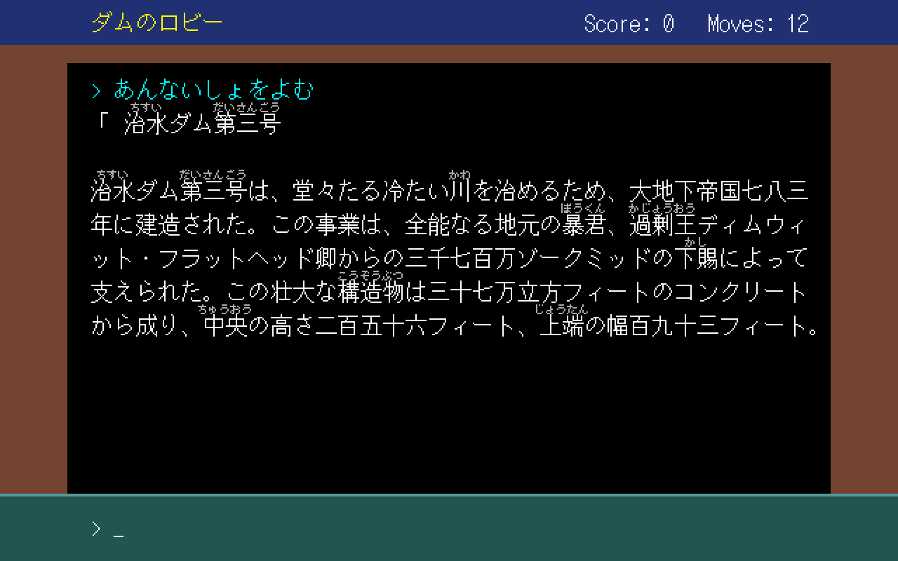

# pc98-mock —— PC-98 版の画面の試作

PC-98 版（計画 = [`docs/pc98-port-plan.md`](../docs/pc98-port-plan.md)）の画面を、
**実際に PC-98 の上で**（QuuBee で）表示して決めるための道具。



## 何があるか

| ファイル | 役目 |
|---|---|
| `layout.py` | 共有部品: 本文の字形（QuuBee の `font.bmp`）・ふりがなの字形（美咲ゴシック）・ふりがなの割り当て（`src/ruby.js` と同じ規則）。★字のコード（漢字 ROM の位置）は `native/pc98_jis.py` を読む（本体と同じ表） |
| `gen_screen.py` | 画面の中身（テキスト VRAM・属性・4 プレーンの背景・パレット）を `out/` に作る。★**寸法と色はこの先頭の数値** |
| `screen.asm` | それを表示する DOS の COM。テキスト画面を 24 ラスタ行にして、グラフィックに背景とふりがなを置く。キーで 25 行に戻る |
| `shot.js` | QuuBee（headless）で起動して撮る |
| `build.sh` | 上の 3 つを通しで回す → `out/screen-{1x,2x}.png` |
| `mock_ruby.py` | 前段: PC-98 を通さずに Python で描いた、ふりがなの見え方の見本（色と帯の中の位置を決めた） |
| `screen-2x.png` | 決まった画面（2026-09-28）。`build.sh` の出力はこれと画素まで一致する |

## 動かす

```sh
sh pc98-mock/build.sh          # → pc98-mock/out/screen-2x.png
python3 pc98-mock/mock_ruby.py # → pc98-mock/out/ruby_gray_dy1_*.png
```

要るもの:

- `python3`（Pillow）・`nasm`・`node`
- **QuuBee のリポジトリ**（`QB_DIR`、既定 `~/development/qb`）—— 本文の字形 `web/assets/font.bmp` と、
  headless の土台 `tools/lib/machine.js`・`web/` のビルドを使う
- **美咲ゴシックの BDF**（`pc98-mock/misaki_gothic.bdf` に置くか `MISAKI_BDF` で指す）。★追跡していない

## 美咲ゴシック（ふりがなの字形）

| | |
|---|---|
| 配布元 | https://littlelimit.net/misaki.htm |
| 版 | `misaki_bdf_2021-05-05.zip` の `misaki_gothic.bdf` |
| 字形 | 7×7（8×8 の枠に 1px の字間を含む）—— 本文 16px の「半分マイナス 1px」 |
| 著作権 | `Copyright(C) 2002-2021 Num Kadoma`（`misaki.txt`） |
| ライセンス | 「改変の有無に関わらず、また商業的な利用であっても、自由にご利用、複製、再配布することができますが、全て無保証」（`misaki.txt`） |

★ここでは BDF を読むだけで同梱していない。ライセンスに表示の義務は書かれていないが、PC-98 版の本体に字形を焼き込むときは
出どころと上の文言を配布物に残す（KH ドットフォントの `native/vendor/kh-dotfont/` と同じ扱い）。

`out/SCREEN.COM` はブラウザの QuuBee に入れてもそのまま見られる。
